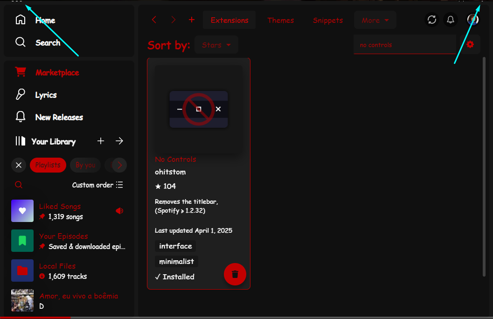

This script removes the minimum, maximum, and close buttons from the titlebar. But it also allows you to toggle via F8 as default because sometimes you have to get to the elipsis menu.

Shoutout to [OhItsTom](https://github.com/ohitstom) for creating the main piece of the extension and the icon I built upon. You can visit his original one [here](https://github.com/ohitstom/spicetify-extensions/blob/main/noControls/README.md)

P.S. I have noticed that for me, you still get a bit of the topbar despite the fact I'm on 1.2.33 and it should be supported from 1.2.32 but not really looked into it.
